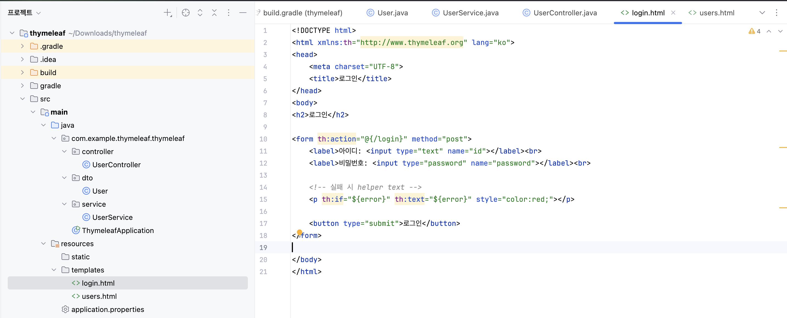
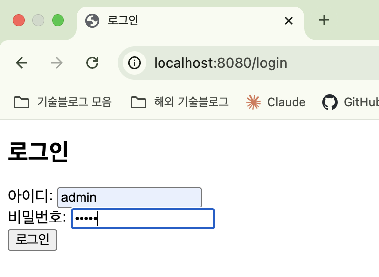
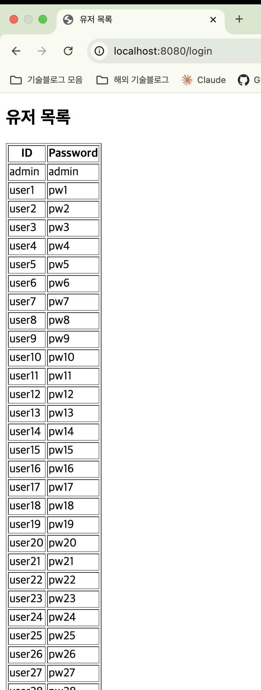
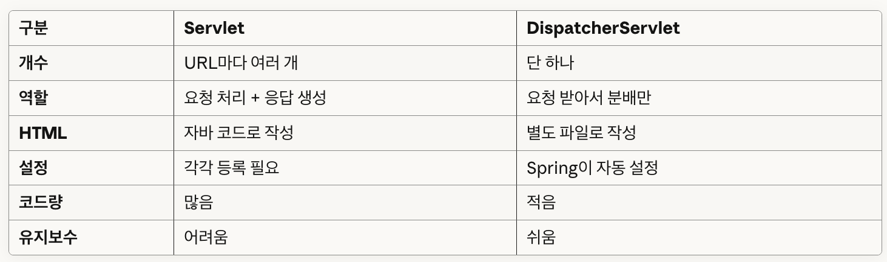

## 📆 2025-10-20

### 🔔 스크럼

[오늘 할 일] 
✔️ 오늘 나갈 수업내용 복습 
 디스패처서블릿(DispatcherServlet)  
 타임리프(Thymeleaf) 
✔️ 이것이 스프링부트다 
데이터베이스 연동 101p ~ 210p 꼼꼼히 정독 
✔️ 백준 코딩테스트 
분류 카테고리 ‘수학’ 1단계부터 5단계 까지 풀기 
✔️ 블레이버스 스케줄 관리 

[어제 한 일] 
✔️ 5주차 과제 진행.  
addEventListener, fetch 이용해서 통신(게시글, 회원가입, 로그인, 조회수, 인피니트스크롤) 
webConfig, SecurityConfig 에서 CORS, 인증 설정 

### 🚀 Today I Learned

#### | 디스패처서블릿(DispatcherServlet)
**서블릿**
HTTP 요청과 응답을 처리하는 자바 웹 애플리케이션의 기본 컴포넌트

**디스패처 서블릿**
모든 HTTP 요청을 받아 적절한 컨트롤러로 분배하는 Spring MVC의 Front Controller

**핸들러 매핑**
HTTP 요청 URL을 처리할 컨트롤러 메서드를 찾아주는 컴포넌트

**핸들러 어댑터**
핸들러 매핑이 찾은 컨트롤러 메서드를 실제로 실행하는 컴포넌트

**뷰 리졸버**
컨트롤러가 반환한 논리적 뷰 이름을 실제 뷰 파일 경로로 변환하는 컴포넌트

#### | 타임리프(Thymeleaf)

**스프링 MVC**
Model-View-Controller 패턴 기반의 Spring 웹 애플리케이션 프레임워크

**템플릿 엔진**
정적 템플릿과 동적 데이터를 결합하여 최종 HTML을 생성하는 도구

**Thymeleaf**
HTML 파일을 그대로 사용할 수 있는 Natural Template 방식의 서버사이드 템플릿 엔진 
 
- **Thymeleaf** 실습 
 
 

 

### 🔥 오늘의 도전 과제와 해결 방법
Servlet 과 DispatchServlet 의 차이에 대한 고민 

 

### 🗨️ 오늘의 회고
<!--
- 오늘의 학습 경험에 대한 자유로운 생각이나 느낀 점을 기록합니다.
- 성공적인 점, 개선해야 할 점, 새롭게 시도하고 싶은 방법 등을 포함할 수 있습니다.-->
오프라인 정규수업 첫 날인데 무언가 사람들도 많아서 완전히 몰입이 되진 않았다. 
그래도 빨리 이 환경에 적응해서 주 100시간 학습을 효율적으로 진행해야겠고 
다가올 팀 협업을 기억하면서 개인의 역량을 최대한 끌어 올려봐야겠다.